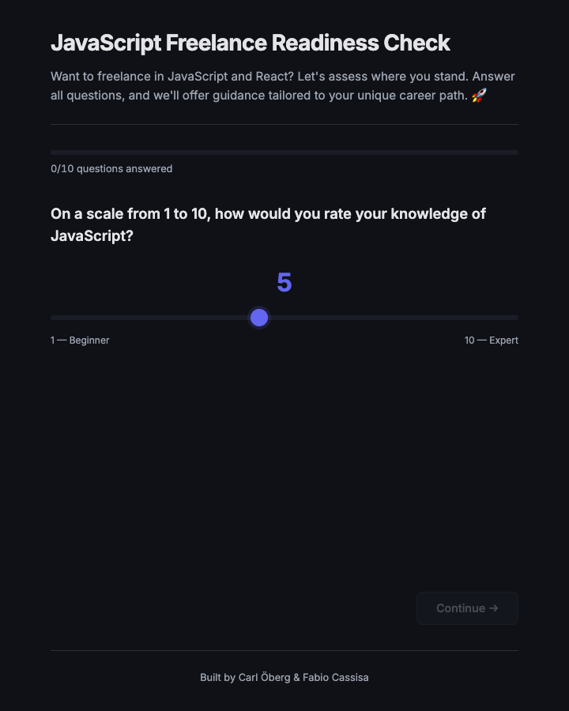
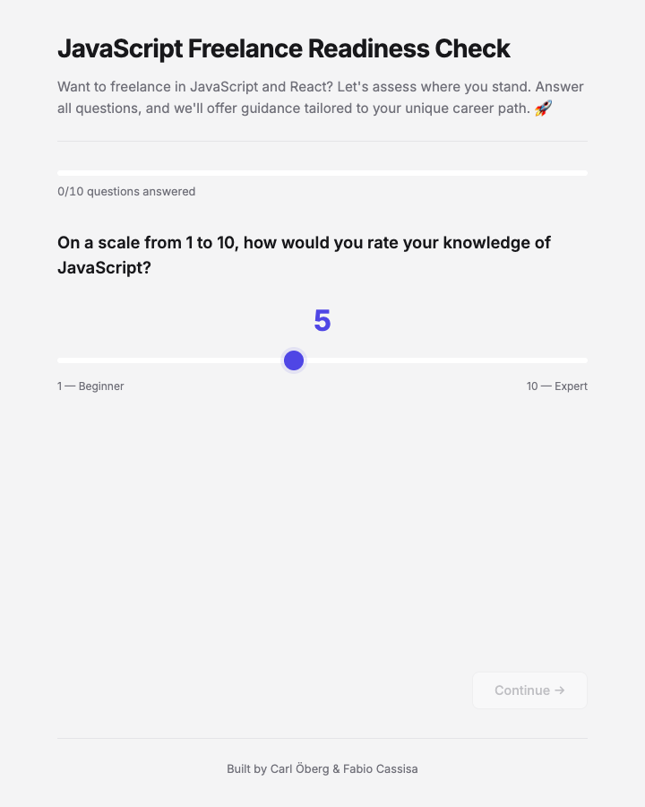
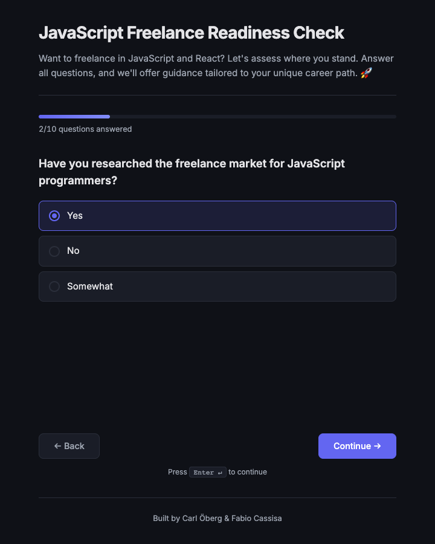
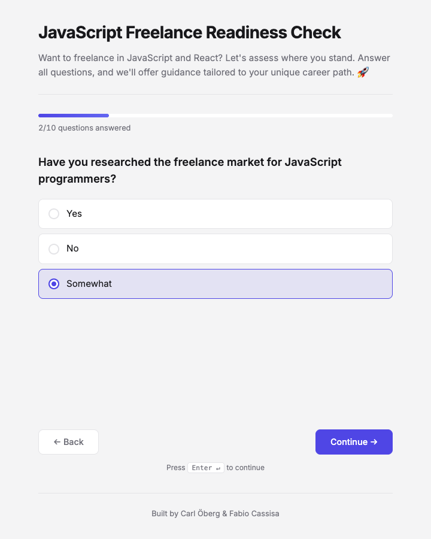
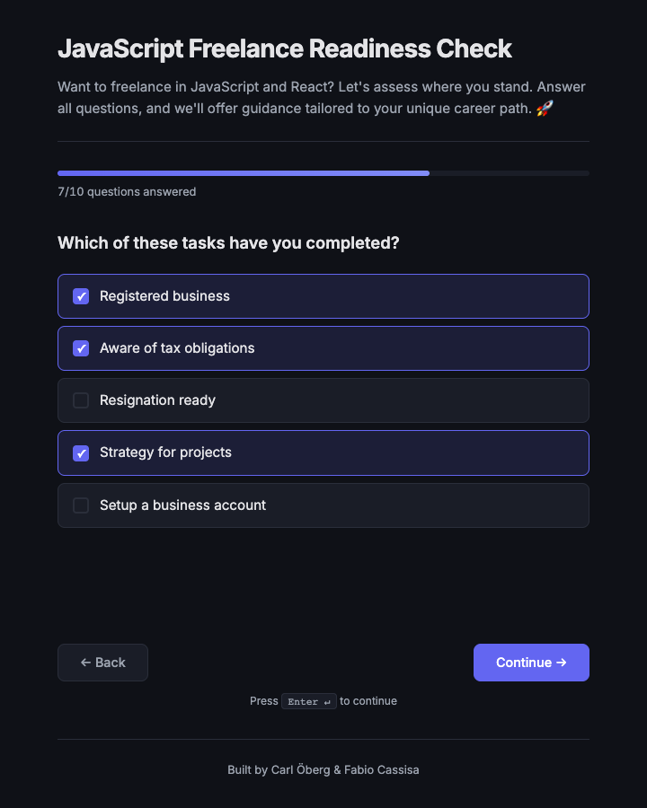
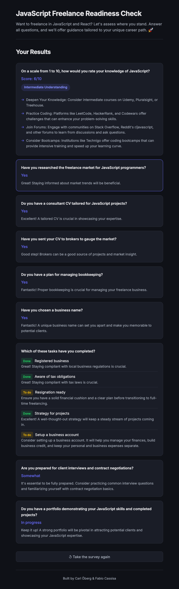

# freelance readiness check

interactive survey that evaluates how prepared you are to go freelance as a javascript developer — then gives you personalized feedback.

## context

built as a pair project during the technigo bootcamp with [carl öberg](https://github.com/Calleobe). the original version worked but felt like a prototype — basic browser-default form controls, light theme, minimal feedback logic.

this version is a full rework: dark-first design, custom-styled inputs across every question type, keyboard navigation, smooth transitions, and a summary page that actually tells you something useful instead of just echoing your answers back.

the survey walks through 10 questions covering market research, business setup, portfolio readiness, and client-facing skills — then scores each area with actionable suggestions.

## screenshots

| dark | light |
|------|-------|
|  |  |
|  |  |
|  | |

<details>
<summary>full summary page (dark)</summary>


</details>

## stack

`react 18` · `vite 4` · `css custom properties` · `vercel`

## features

- **5 input types** — range slider, radio buttons, checkboxes, dropdown, text/email — all custom styled
- **keyboard navigation** — press Enter to advance (skips text inputs to avoid conflicts)
- **slide-in transitions** — css keyframe animations between questions
- **smart summary** — done/to-do badges per area, skill level pills, suggestion arrows
- **system theme** — dark by default, respects `prefers-color-scheme: light`
- **progress bar** — visual step indicator
- **restart** — take it again without refreshing

## structure

```
src/
├── components/
│   ├── SurveyApp.jsx          # main controller — state, keyboard nav, routing
│   ├── Summary.jsx            # results page with cards and suggestions
│   ├── RadioButtonQuestion.jsx
│   ├── CheckboxQuestion.jsx
│   ├── RangeSliderQuestion.jsx
│   ├── DropdownQuestion.jsx
│   ├── TextInputQuestion.jsx
│   ├── NewsletterQuestion.jsx
│   ├── Progress.jsx
│   ├── Header.jsx
│   └── Footer.jsx
├── data/
│   └── questions.js           # extracted question config
├── styles/
│   └── SurveyApp.css          # unified component styles
├── index.css                  # global reset + theme variables
└── main.jsx
```

## run locally

```bash
npm install
npm run dev
```

## status

🟢 live — [project-survey-vite-brown.vercel.app](https://project-survey-vite-brown.vercel.app)

---

<sub>built by [fabio cassisa](https://github.com/fabio-cassisa) · paired with [carl öberg](https://github.com/Calleobe)</sub>
